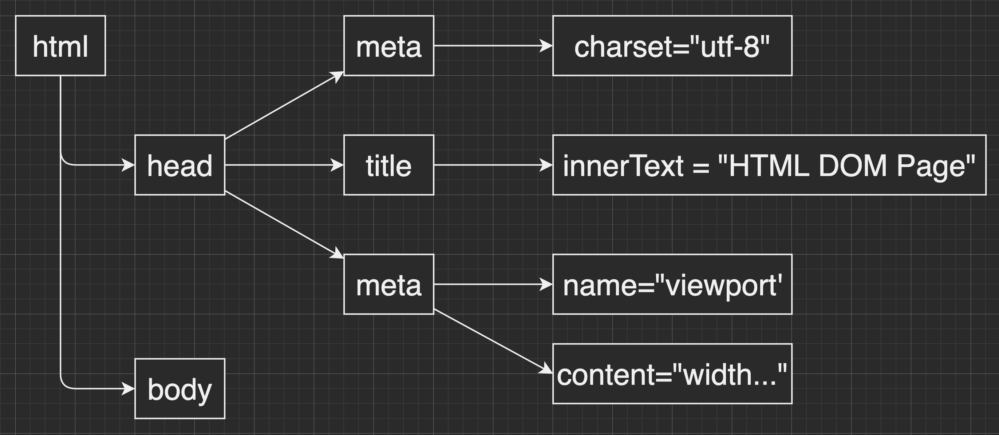

# Chapter 4. javaScript

## Web Digital Marketing Programming

---

<!--
paginate: true
theme: default
size: 16:9
footer: 국민대학교 경영대학원 디지털마케팅 MBA,  Wooyoung Choi, 2022
-->

<div style="margin:auto;">
  
</div>

[https://github.com/km-ulgoon/mktg-web-programming](https://github.com/km-ulgoon/mktg-web-programming)

---

### 함수(function)

`function name(parameter){ Statements }`

`function square(num){return num*num;}`

- 어떤 집합의 각 원소를 다른 어떤 집합의 유일한 원소에 대응시키는 이항관계(Mathematics)
- 특정 동작을 수행하는 코드의 일정 부분
- 큰 프로그램을 여러 부분으로 분리하여 구조적 프로그래밍을 가능하게 함
- 미리 정의된 기능을 재사용하여 용량을 줄이고, 효율성 극대화
- 기능과 구현을 분리하는 캡슐화(Encapsulation)가 이루어짐
- 입력과 출력으로 나뉘며, 반환은 하지 않아도 됨

---

#### no input, no output

`function sayHello(){console.log('Hello');}`

#### with input, no output

`function sayHello(name){console.log('Hello, ${name}');}`

#### no input, with output

`function sayHello(){return 'Hello';}`

#### with input, with output

`function sayHello(name){return 'Hello, ${name}';}`

---

### Make aweSum!!

```javascript
function aweSum(num){return num;}
function aweSum(num1, num2){return [num1,num2];}
function aweSum(num1, num2){return num1+num2+1;}
```

---

### 조건문(Conditional Statements)

- 특정조건을 만족했을 때 실행하는 명령들의 모음
- JavaScript는 if와 switch가 있음

---

#### If statements

```javascript
if (condition) {
  statement;
} else {
  statement;
}
```

---

#### If, else

```javascript
var num=15; // set num 5 to test fail case
if (num===15){
  console.log("num is 15.");
} else {
  console.log("num is not 15.");
}
```

---

#### If, else If, else

```javascript
var num=15; // set num 7, 5 to test fail case
if (num===15){
  console.log("num is 15.");
} else if (num===7){
  console.log("num is not 15, but 7.");
} else {
  console.log("num is not 15 nor 7.");
}
```

---

#### Do it yourself

- 사용자로 부터 입력을 받아(`prompt()`) 사용자가 다음 조건을 만족할 때에만 인사를 하세요
- 사용자의 이름이 `John`일 경우, `"Hi, John"`
- 사용자의 이름이 `Jane`일 경우, `"Hello, Jane"`
- 그렇지 않은 모든 경우, `"Nah, You are not my guys.."`

---

### 반복문(Loops)

- 어떤 일을 반복하고 싶을 경우 사용하는 구문
- for, while, do..while 등이 있음
- for: 초기값과 유지조건, 증감연산으로 구문 반복
  - 반복의 조건이 명시적일 경우 사용
  - 조건과 증감이 구문과 분리되어 있어 가독성이 높음
- while: 조건이 false가 될 때 까지 구문 반복
  - 반복의 조건이 명시하기 힘들 경우, 유동적일 경우 사용
  - false가 될 조건을 명시하거나 break 를 이용해 종료 조건을 꼭 명시해야함

---

#### for Statement

`for (initializer; condition; final-expression){statement}`

```javascript
for (var i=1;i<10;i++){console.log(n)}
for (var i=1;i<10;i++){
  var result = `${i} x ${i} = ${i*i}`;
  console.log(result);
}
```

---

#### for with array

```javascript
var animals = ['dog', 'cat', 'hamster'];
for (var animal of animals){console.log(animal)};

for (var i=0;i<animals.length;i++){console.log(animals[i])};
```

---

#### while Statement

`while (condition){statement}`

```javascript
var i=0;
while (i<10){
  console.log(i);
  i++;
  if (i===5){break;}
}
```

---

#### Say what I want to hear..

```javascript
var menu = '';
while (menu!='bibimbob'){
  var menu = prompt("What do you want to eat for lunch?");
  console.log('No way..');
  if (menu==='gookbob'){
    console.log("Are you kidding me?");
    break;
  }
}
```

---

#### break, continue

- break: 반복문 수행을 멈추고 완전 종료
- continue: 해당 세션을 종료하고 다음 세션으로 넘어감

```javascript
for (var i=0; i<20;i++){
  if (i%2===0){
    continue;
  } else if (i%13===0){
    break;
  } else {
    console.log(i);
  };
};
```

---

### HTML DOM API


---

#### What is DOM?

- DOM(Document Object Model): 문서 객체 모델
- 문소의 구조화된 표현(Structured representation)을 제공
- 프로그래밍 언어가 DOM 구조에 접근할 수 있는 방법을 제공하여 문서구조, 스타일, 내용의 변경을 도움
- window 또는 document 를 통해 문서의 children(element)에 접근
- window > document > element

---

```html
<html>
  <head>
    <meta charset=“utf-8”>
    <title>HTML DOM Page</title>
    <meta name=“viewport” content=“width=device-width, initial-scale=1.0”>
  </head>
  <body>
    <section>
      <h1 id=“main-title”>Main page</h1>
      <p class=“text-content”>This is main page.</p>
    </section>
  </body>
</html>
```

---



---

### Let's control HTML DOM

---

### Find Element

```javaScript
document.getElementById(id)
document.getElementByTagName(tagname)
document.getElementByClassName(classname)
```

```javaScript
var mainArticle = document.querySelectorAll("div.main-article");
```

### Change Element

```javaScript
element.innerHTML = 'new content'
element.setAttribute(attribute, value)
element.{{attribute}} = 'new value'
element.style.{{property}} = new style
```

---

### Add Event Handler

```javaScript
element.onclick = function(){alert('hello')}
```

---

### event handler, event listener

- Event Handler(discouraged): 하나의 요소에 하나의 이벤트 처리
  - event handler attribute
    - `<button onclick="console.log()"></button>`
  - event handler property
    - `element.onclick=function(){};`
- Event Listener: 하나의 요소에 복수의 이벤트 처리
  - addEventListener method
    - `element.addEventListener(type, listener[, options, useCapture])`
    - type: https://developer.mozilla.org/ko/docs/Web/Events

---

### example

```javascript
<div class="color-box" style="width:100px;height:100px;"></div>
<button onclick="alert('Clicked!')">Click me</button>
<button class="hover-red">Do not click me</button>
<label for="promo-code">Promo code</label>
<input id="promo-code" type="text" name="promocode" style="text-transform:uppercase;">
<input id="submit-promo" type="submit">
```

---

### example(계속)

```javascript
<script>
var btnElement = document.querySelectorAll(".hover-red")[0];
btnElement.onmouseover = function(){
    var boxElement = document.querySelector(".color-box");
    boxElement.textContent = "I said DO NOT CLICK!";
    boxElement.style.backgroundColor = "#ff0000";
    
};
var submitElement = document.querySelector("#submit-promo");
function focusPromo(){
    var inputElement = document.querySelector("#promo-code");
    if (submitElement.value==''){
        inputElement.focus();
        inputElement.style.backgroundColor = "#fc4444";
    }
};
submitElement.addEventListener('click', focusPromo);
</script>
```

---

### Cookie and Session

---

#### HTTP와 Cookie, Session

- HTTP Protocol: 서버는 클라이언트가 누구인지 연결때 마다 확인해야 함
  - Connectionless: 클라이언트가 응답을 받으면 연결이 종료되는 특징
    - (Connection: Keep-Alive, Keep-Alive: timeout=5, max=1000) 설정
    - HTTP/2 부터 다른 매커니즘으로 처리
    - 해당 옵션으로 연결비용을 줄임
  - Stateless: 통신이 끝나면 상태를 유지하지 않는 특징
    - 연결을 끊는 순간 서버와 통신이 끝나며 정보를 유지하지 않음
    - 두번째 통신에서 이전 통신의 데이터를 유지하지 않게됨

---

#### W/o cookie, session

- 페이지를 이동할때(요청,응답) 마다 로그인을 요구하게됨(사용자정보 유지 X)
- 장바구니에 상품을 담고(정보) 페이지를 이동하면(요청,응답) 장바구니가 초기화 됨
- 뒤로가기의 제대로된 동작 불가
- 웹 페이지 로딩을 느리게 만들고 UX 관점에서 사용자의 많은 불편을 초래함

---

### Cookie

- 클라이언트(브라우저)에 저장되는 키와 값으로 이루어진 데이터파일
- 필요할 때 정보를 참조하거나 재사용할 수 있게 됨
- 이름, 값, 만료일, 경로 정보로 구성
- 클라이언트 제한: 300개
- 도메인 제한: 20개
- 쿠키 크기 제한: 4KB
- 클라이언트가 가지기 때문에 변질 우려

#### 쿠키 동작 순서

클라이언트의 페이지 요청 -> 서버의 쿠키 생성 후 클라이언트에 전달 -> 로컬에 저장한 뒤 서버에 요청할 때 함께 전송, 재방문시 쿠키가 있을 경우 함께 전송

---

### Session

- 일정 시간동안 같은 사용자로 부터 들어오는 요청을 하나의 상태로 보고, 그 상태를 유지하는 기술
- 일정 시간: 웹서버 접속 ~ 브라우저 종료
- 방문자가 웹 서버에 접속해 있는 상태의 단위

#### 특징

- 상태를 유지하기 위한 정보를 웹 서버에 저장
  - 브라우저를 닫거나 세션이 종료되어 삭제될때만 삭제됨
  - 브라우저 쿠키에 비해 보안에 유리
- 데이터에 제한 없음
- 각 클라이언트에 고유의 Session ID를 부여

---

#### 세션 동작 순서

클라이언트의 페이지 요청 -> Cookie를 확인하여 session-id를 보냈는지 확인

- 존재하지 않는다면 session-id를 발급하여 전달
- 해당 session-id를 세션쿠키를 사용해 서버에 저장
- 재접속 시 해당 session-id를 활용하여 로그인 사용자 식별
- 서버비용의 문제로 인해 유휴중인 세션은 적절한 시간(보통 1800초) 후 자동 파기

---

#### Cookie vs Session

|Cookie|vs|Session|
|:--|:--:|:--|
|클라이언트|저장위치|서버|
|브라우저 종료시 삭제(or custom)|저장기간|브라우저 종료시 삭제(or custom)|
|클라이언트 텍스트 파일|저장방식|웹 서버|
|300개,도메인당 20개, 쿠키당 4KB|용량제한|없음|
|빠름|속도(상대적)|느림|
|낮음|보안(상대적)|높음|

---

### Cache

- 리소스 파일들의 임시저장소
- 같은 페이지에 접속할 때 동일한 Resource를 재사용 하기 위함
- 페이지 로딩 속도 개선
- Image, Video, Audio, CSS, JS 등 Static files

<link href="https://fonts.googleapis.com/css?family=Nanum+Gothic:400,800" rel="stylesheet">
<link rel='stylesheet' href='//cdn.jsdelivr.net/npm/hack-font@3.3.0/build/web/hack-subset.css'>

<style>
h1,h2,h3,h4,h5,h6,
p,li, dd, table > * > * {
font-family: 'Nanum Gothic', Gothic;
}
span, pre {
font-family: 'Hack', monospace;
}
</style>